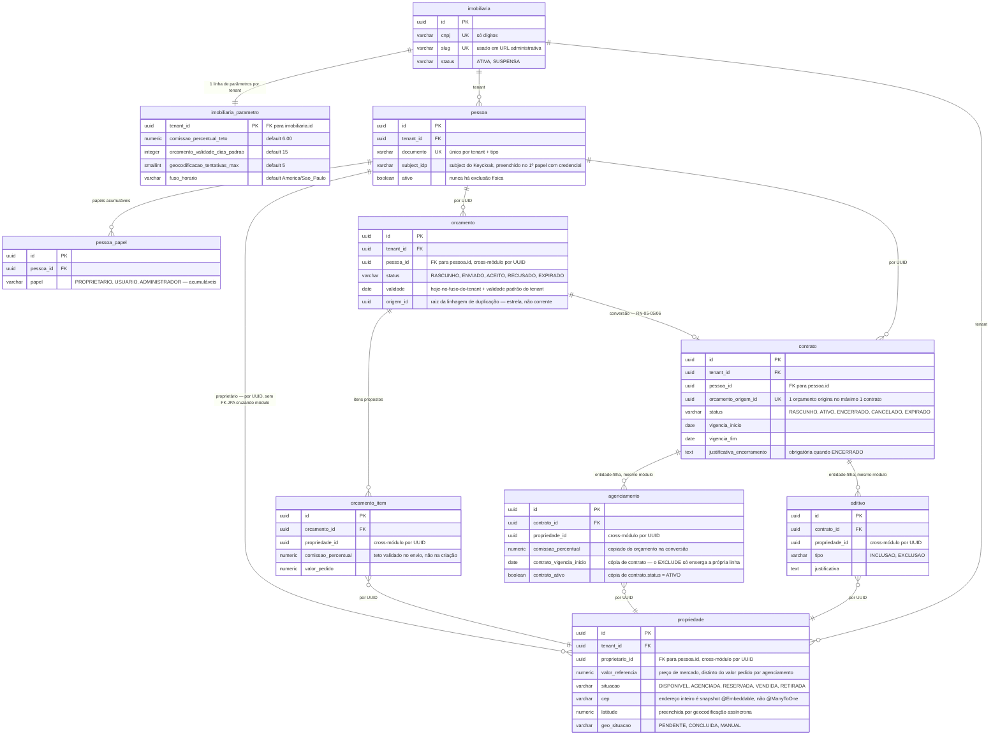

# Controle imobiliário SaaS

> Backend de um SaaS multi-tenant de administração de corretora de imóveis.
> Projeto de portfólio: a ênfase é clareza arquitetural e justificativa de decisão, não quantidade de features.


Frontend Angular em repositório separado: [`imoveisfrontSaas`](https://github.com/rockgustavo/imoveisfrontSaas).

---

## Como subir

**Pré-requisito:** Docker Desktop rodando.

```bash
docker compose up -d                                        # backend + banco + Keycloak
cd ../imoveisfrontSaas && npm install && npm start           # frontend, repositório ao lado
```

Nenhum passo manual: o Flyway migra o banco e o realm do Keycloak (usuários, papéis e client) é importado de arquivo versionado a cada subida.

| O quê | URL | Credencial |
|---|---|---|
| **Aplicação** | http://localhost:4200 | `admin.dev` / `admin123` |
| **Swagger UI** | http://localhost:8088/swagger-ui.html | botão *Authorize* → mesmo login |
| API | http://localhost:8080 | `Authorization: Bearer <JWT>` |
| Keycloak (console) | http://localhost:8081/admin | `admin` / `admin` |
| PostgreSQL | `localhost:5435` / db `imobiliaria` | `imobiliaria` / `imobiliaria` |

Dois usuários de desenvolvimento: `admin.dev` (`ADMINISTRADOR`, opera o tenant `imobiliaria-demo`) e `plataforma.dev` (`PLATAFORMA_ADMIN`, provisiona novas imobiliárias) — ambos com senha `admin123`.

> A porta `5435` evita colisão com outro PostgreSQL na máquina; dentro da rede do Docker os containers seguem na `5432`.

### Fora do container

```bash
mvn spring-boot:run    # http://localhost:8088, profile dev
mvn verify             # testes + fronteiras de módulo + export do contrato OpenAPI
```

O profile `dev` usa a `8088` e o container a `8080` — portas diferentes de propósito, os dois rodam ao mesmo tempo sem disputa.

---

## Arquitetura

### Monólito modular extraível

A fronteira de primeiro nível é o **domínio**, não a camada técnica — cada módulo é candidato natural a virar serviço próprio, se um dia precisar.

```
br.com.rockgustavo.imobiliaria/
├── shared/           infra transversal, sem regra de negócio
│                     config/ security/ tenant/ exception/ audit/ geo/
├── imobiliaria/      ┐
├── pessoa/           │  módulos de domínio, todos com a mesma forma interna:
├── propriedade/      │
├── orcamento/        │    <Modulo>Facade.java   único ponto público do módulo
└── contrato/         │    api/                  controller + DTO
                      │    domain/               entidade, enums, invariantes (Java puro)
                      │    application/          casos de uso, @PreAuthorize
                      ┘    infra/                JPA (escrita) + JdbcClient (leitura)
```

| Módulo | O que a `Facade` expõe, e para quem |
|---|---|
| `imobiliaria` | Parâmetros do tenant (teto de comissão, fuso, validade padrão) — consumida por todos |
| `pessoa` | Responde `AcessoPort` (revogação, ADR-08); adaptador Keycloak em `infra` (ADR-07) |
| `propriedade` | Posse, disponibilidade e transição de situação — consumida por `orcamento` e `contrato` |
| `orcamento` | Orçamento aceito (pessoa + itens) para conversão — consumida por `contrato` |
| `contrato` | Ainda sem consumidor |

`shared/geo` guarda as portas `CepClient`/`GeocodificacaoClient`, os adaptadores (BrasilAPI, Nominatim) e `cep_cache` — infra genérica, sem `tenant_id`, sem conhecer `propriedade` (ADR-15). O que precisa do agregado ou de parâmetro por tenant fica em `propriedade/application`.

| Regra de fronteira | Por quê |
|---|---|
| Um módulo só importa a `Facade` de outro — nunca `api/`, `domain/`, `application/`, `infra/` | Impede o acoplamento crescer por dentro; extrair o módulo vira mudar uma chamada, não desembaraçar um grafo |
| Relacionamento entre módulos é por `UUID`, nunca `@ManyToOne` cruzando módulo | Sem grafo de objetos compartilhado, cada módulo tem seu próprio ciclo de vida |
| `shared/` não conhece nenhum módulo de domínio | Dependência em uma direção só — o transversal não vira depósito de regra de negócio |

Isso não é convenção documentada torcendo para ser seguida: `ApplicationModules.verify()` roda como teste. Quebrou a fronteira, quebrou o build.

**FK entre módulos continua existindo no banco.** A regra acima é sobre o grafo de objetos Java. Como todos os módulos compartilham um banco, remover integridade referencial só para "parecer" desacoplado trocaria garantia real por estética.

### CQRS leve — JPA escreve, `JdbcClient` lê

| | Escrita (JPA) | Leitura (`JdbcClient`) |
|---|---|---|
| Carrega | Agregado completo, para aplicar a regra | Só as colunas da resposta |
| Mapeia para | Entidade | `record` direto, sem entidade intermediária |
| Joins | `JOIN FETCH`/`@EntityGraph`, risco de N+1 | SQL explícito, otimizável e `EXPLAIN`-ável |

Os dois lados têm necessidades opostas: escrita precisa do agregado inteiro para validar invariante, leitura precisa de exatamente as colunas que a tela mostra. ORM nos dois lados obriga a escolher qual deles vai sofrer.

Daí decorre, em todo o projeto: `open-in-view` fica `false` (um `LazyInitializationException` significa query errada, não configuração faltando), nenhuma listagem sai sem paginação e nenhuma query sai sem filtro de tenant.

### Multi-tenancy

`tenant_id` vem da claim do JWT — nunca de header, parâmetro ou body, que o cliente controla. O isolamento é aplicado por dois mecanismos independentes, um por lado do CQRS, porque são caminhos de código que não compartilham nada: `@TenantId` do Hibernate na escrita, `WHERE tenant_id = :tenantId` explícito em cada `*QueryRepository` na leitura.

Recurso de outro tenant retorna **`404`, nunca `403`**: um `403` confirmaria que o recurso existe para quem não deveria nem saber disso. Há um teste de integração que tenta furar o isolamento e espera falhar — não é removido nem quando parece redundante.

**Tenant fora da requisição HTTP.** `TenantContext` é um `ThreadLocal`, e a geocodificação assíncrona foi o primeiro código a rodar fora da thread que o filtro preenche. O job `@Scheduled` cruza tenants por natureza e define o contexto por candidato dentro do laço; o listener assíncrono precisa do tenant **antes** do proxy transacional abrir sessão, então um `TaskDecorator` propaga o `ThreadLocal` da thread que publicou o evento (ADR-15).

### Segurança

```
Navegador ──login──▶ Keycloak ──JWT──▶ Backend (valida assinatura via JWKS)
```

O backend é **Resource Server stateless**: nunca faz login, nunca emite token, nunca guarda senha — tira do projeto a responsabilidade de armazenar credencial, a parte mais fácil de errar em segurança.

| Papel | Escopo |
|---|---|
| `PLATAFORMA_ADMIN` | Fora do modelo de tenant — provisiona imobiliárias |
| `ADMINISTRADOR` | Dentro do tenant — gerencia parâmetros |
| `USUARIO` | Dentro do tenant — operacional |

| Decisão | Por quê |
|---|---|
| Erro sempre em `ProblemDetail` (RFC 7807), sem stacktrace, classe ou SQL — em nenhum profile | Não criar o hábito de depurar por mensagem de erro exposta |
| `400` de validação carrega extensão `campos` (campo → mensagem), não só texto solto | Permite ao cliente marcar o campo exato; texto fixado em `ValidationMessages.properties`, não no `Accept-Language` de quem chamou |
| `issuer-uri` (`localhost:8081`) separado de `jwk-set-uri` (`keycloak:8081`) | O `iss` do token precisa bater com o hostname que o navegador usa, mas o backend em container não alcança o próprio `localhost` — sem separar, ou o navegador não loga ou o backend não valida |
| Revogação por interceptor com cache de 5s, invalidado na inativação (RN-02-04, ADR-08) | O backend não controla o ciclo de vida do JWT; sem invalidação explícita, a revogação dependeria do TTL. `shared/security` declara `AcessoPort`, `pessoa` responde — inverte a dependência que a fronteira de módulo proíbe |
| Ninguém altera os próprios papéis (RN-02-03) | Evita autopromoção/autorrebaixamento sem um segundo administrador na decisão |

Formato completo de erro e validação em [`docs/convencoes-api.md`](docs/convencoes-api.md).

---

## Modelo de dados

Escopo atual (Épicos 00–06). Dicionário completo em [`docs/modelo-de-dados.md`](docs/modelo-de-dados.md).



Toda tabela carrega `criado_em`/`criado_por`/`alterado_em`/`alterado_por` (omitidos acima; `pessoa_papel` só tem os dois primeiros — vínculo é criado ou removido, nunca editado). `imobiliaria` não tem `tenant_id` — ela **é** o tenant.

Fora do diagrama por não se relacionarem com nada acima: `cep_cache` (sem `tenant_id` — CEP tem o mesmo endereço para qualquer tenant, ADR-06) e `event_publication` (schema oficial do `spring-modulith-events-jdbc`, criado por migration, ADR-15).

**Parâmetro não retroage.** Quem usa um parâmetro (validade de orçamento, teto de comissão) **copia** o valor no momento relevante, em vez de fazer `JOIN` na leitura — mudar o teto hoje não reescreve contratos já assinados.

---

## Endpoints

| Método | Rota | Papel | Descrição |
|---|---|---|---|
| POST | `/api/v1/plataforma/imobiliarias` | `PLATAFORMA_ADMIN` | Provisiona uma imobiliária (tenant) |
| GET | `/api/v1/tenant` | `USUARIO`, `ADMIN` | Identidade da imobiliária do token |
| GET&nbsp;/&nbsp;PUT | `/api/v1/tenant/parametros` | `ADMIN` | Parâmetros do tenant corrente |
| POST | `/api/v1/pessoas` | `ADMIN` | Cadastra pessoa (CPF/CNPJ validado, único por tenant) |
| GET | `/api/v1/pessoas` | `USUARIO`, `ADMIN` | Lista paginada — filtra por documento/papel/classificação/situação |
| GET&nbsp;/&nbsp;PUT | `/api/v1/pessoas/{id}` | `USUARIO`* / `ADMIN` | Detalha e atualiza dados cadastrais |
| POST | `/api/v1/pessoas/{id}/papeis` | `ADMIN` | Atribui papel — provisiona credencial no Keycloak quando `USUARIO`/`ADMINISTRADOR` |
| DELETE | `/api/v1/pessoas/{id}/papeis/{papel}` | `ADMIN` | Remove papel — rejeita remover o último `ADMINISTRADOR` ativo |
| POST | `/api/v1/pessoas/{id}/inativacao` | `ADMIN` | Inativa pessoa — nunca exclusão física |
| GET | `/api/v1/ceps/{cep}` | `USUARIO`, `ADMIN` | Endereço por CEP — cacheado pela janela do tenant, `200` mesmo quando não encontrado |
| POST | `/api/v1/propriedades` | `USUARIO`, `ADMIN` | Cadastra — proprietário precisa ter papel `PROPRIETARIO` e estar ativo |
| GET | `/api/v1/propriedades` | `USUARIO`, `ADMIN` | Lista paginada — filtra por situação/proprietário/localidade/UF/faixa de valor |
| GET&nbsp;/&nbsp;PUT | `/api/v1/propriedades/{id}` | `USUARIO`, `ADMIN` | Detalha e atualiza — troca de proprietário rejeitada com agenciamento vigente |
| POST | `/api/v1/propriedades/{id}/retirada` | `USUARIO`, `ADMIN` | `DISPONIVEL → RETIRADA`, terminal |
| POST&nbsp;/&nbsp;DELETE | `/api/v1/propriedades/{id}/reserva` | `USUARIO`, `ADMIN` | `AGENCIADA ⇄ RESERVADA` |
| POST | `/api/v1/propriedades/{id}/venda` | `USUARIO`, `ADMIN` | `RESERVADA → VENDIDA`, terminal — marcação manual, sem dado financeiro (Épico 10) |
| POST | `/api/v1/orcamentos` | `USUARIO`, `ADMIN` | Cria em `RASCUNHO` — pessoa precisa estar ativa |
| GET | `/api/v1/orcamentos` | `USUARIO`, `ADMIN` | Lista paginada — filtra por pessoa/status |
| GET&nbsp;/&nbsp;PUT | `/api/v1/orcamentos/{id}` | `USUARIO`, `ADMIN` | Detalha (itens embutidos) e atualiza itens por diff — `PUT` só em `RASCUNHO` |
| POST | `/api/v1/orcamentos/{id}/envio` | `USUARIO`, `ADMIN` | `RASCUNHO → ENVIADO` — checa posse, disponibilidade e teto de comissão |
| POST | `/api/v1/orcamentos/{id}/aceite` | `USUARIO`, `ADMIN` | `ENVIADO → ACEITO` — exige validade vigente |
| POST | `/api/v1/orcamentos/{id}/recusa` | `USUARIO`, `ADMIN` | `ENVIADO → RECUSADO` — exige validade vigente |
| POST | `/api/v1/orcamentos/{id}/duplicacao` | `USUARIO`, `ADMIN` | Nova versão em `RASCUNHO` de qualquer status — origem aponta para a raiz da linhagem |
| POST | `/api/v1/contratos` | `USUARIO`, `ADMIN` | Cria em `RASCUNHO` a partir de orçamento `ACEITO` — pessoa e itens copiados, não redigitados |
| GET | `/api/v1/contratos` | `USUARIO`, `ADMIN` | Lista paginada — filtra por pessoa/status/dias até vencer |
| GET | `/api/v1/contratos/{id}` | `USUARIO`, `ADMIN` | Detalha, com agenciamentos e aditivos embutidos |
| POST | `/api/v1/contratos/{id}/ativacao` | `USUARIO`, `ADMIN` | `RASCUNHO → ATIVO` — move propriedades para `AGENCIADA`; exclusividade garantida pelo `EXCLUDE` do banco |
| POST | `/api/v1/contratos/{id}/encerramento` | `USUARIO`, `ADMIN` | `ATIVO → ENCERRADO` — distrato antecipado, exige justificativa |
| POST | `/api/v1/contratos/{id}/cancelamento` | `USUARIO`, `ADMIN` | `→ CANCELADO` — rejeitado se alguma propriedade estiver `RESERVADA`/`VENDIDA` |
| POST | `/api/v1/contratos/{id}/aditivos` | `USUARIO`, `ADMIN` | Inclusão, exclusão ou renegociação de propriedade em contrato `ATIVO` |

`ADMIN` = `ADMINISTRADOR`. \* `GET /pessoas/{id}` aceita `USUARIO`; o `PUT` exige `ADMINISTRADOR`.

Contrato completo em [`docs/api/openapi.json`](docs/api/openapi.json) — gerado e versionado a cada `mvn verify`, então mudança de contrato aparece como diff no PR, não como surpresa em produção.

---

## Testes

| Camada | Como |
|---|---|
| Domínio — invariantes e transições | JUnit puro, sem Spring |
| Aplicação e API — casos de uso, contrato HTTP, `401`/`403`/`404` | `@SpringBootTest` + `MockMvc` + Testcontainers |
| Arquitetura — fronteiras de módulo | Spring Modulith `verify()` |
| Isolamento — vazamento entre tenants | Teste de integração dedicado |

Banco de teste é **sempre Testcontainers com PostgreSQL real, nunca H2**: com `ddl-auto: validate`, o Flyway roda do zero a cada execução e prova que entidade JPA e schema não divergiram. Um H2 "parecido o suficiente" esconderia exatamente a classe de bug que esse teste existe para pegar.

JaCoCo tem piso alto em `*/domain/**`. Meta de cobertura global fica de fora de propósito — dilui e passa sem testar a invariante que importa.

Quatro testes existem por terem pego bug real, e não saem daqui:

| Teste | O que ele pega que os outros não pegam |
|---|---|
| `ContratoConcorrenciaIT` | Duas threads (`CyclicBarrier`, cada uma com seu `TenantContext`/`SecurityContext`) ativam contratos de vigência sobreposta na mesma propriedade. Prova que **o banco** decide RN-06-05, não uma checagem de aplicação com janela de corrida embutida — e revelou que o Postgres resolve essa corrida de duas formas (`exclusion_violation` ou `deadlock`), das quais só a primeira era tratada (ADR-17) |
| `ContratoListagemContagemDeQueriesIT` | `DataSource` decorado contando `prepareStatement`, porque `SessionFactory.getStatistics()` mede zero numa leitura via `JdbcClient`. Pegou `listar()` resolvendo o fuso do tenant mesmo sem o filtro que precisa dele |
| `GeocodificacaoAssincronaIT` | `201` imediato e só então Awaitility até `geoSituacao = CONCLUIDA`. Pegou o `TenantContext` perdido na thread assíncrona — que falhava por *timeout*, não por exceção: o listener rodava, terminava sem erro e gravava no tenant errado (ADR-15) |
| Matriz 5×5 de `SituacaoPropriedade` | As 25 combinações, não uma amostra. O bug que apareceu foi de *qual método* usar, não da tabela: `desfazerReserva()` usava a transição genérica para `AGENCIADA`, alcançável também de `DISPONIVEL` — quem pegou foi o teste de API percorrendo o caminho inválido inteiro |

Lacuna assumida: `venda` e desfazer reserva não têm gatilho de sucesso via HTTP (nenhuma RN do MVP os aciona a partir de um contrato), então são cobertos só no nível de domínio — fecha no Épico 10, fora do MVP.

---

## Decisões técnicas

Registro completo (17 ADRs, com contexto e consequência): [`docs/decisoes-tecnicas.md`](docs/decisoes-tecnicas.md).

| Decisão | Motivação |
|---|---|
| UUID v7 gerado na aplicação, sem sequencial interno | Um identificador por entidade — o mesmo que a API devolve. Ordenável por tempo, ao contrário de UUID aleatório em índice |
| Isolamento de tenant em dois mecanismos | Escrita e leitura não compartilham código; um mecanismo só cobriria metade do risco |
| Realm único do Keycloak, tenant por claim | Realm por tenant exigiria resolver múltiplos emissores no Resource Server — complexidade que a regra de negócio não pede |
| Sem MapStruct | `record` + factory method é explícito, auditável e sem reflection — suficiente neste tamanho |
| Sem mensageria/broker | Eventos do Modulith cobrem o assíncrono do MVP sem introduzir infra que precisaria ser operada |
| Adaptador Keycloak com `RestClient`, sem SDK oficial | `keycloak-admin-client` traz RESTEasy como transitiva — risco real de conflito com o Tomcat embarcado, por duas chamadas HTTP simples |
| `AcessoPort` em `shared`, implementado em `pessoa` | O interceptor de revogação mora em `shared` e roda para toda rota, mas quem sabe se a pessoa está ativa é `pessoa` — e `shared` não pode importar módulo de domínio. A interface inverte a dependência (ADR-08) |
| Endereço recebido pronto no Épico 03, sem CEP client | `GET /ceps/{cep}` só existe no Épico 04. `POST /propriedades` recebe o endereço já resolvido, com `enderecoValidado` explícito (ADR-13) |
| Reconciliação de RN-03-09 como stub no Épico 03, preenchida no 06 | `contrato`/`agenciamento` só passaram a existir no 06 — até lá não havia contra o que reconciliar. O `@Scheduled` já rodava desde o 03 (ADR-14) |
| BrasilAPI para CEP, Nominatim para geocodificação | Nominatim é o geocodificador do próprio OpenStreetMap, mesmo ecossistema do Leaflet no front. As duas portas trocam de adaptador sem tocar em domínio (ADR-15) |
| Backoff exponencial sem coluna nova | O retry reaproveita `alterado_em` como carimbo da última tentativa. Efeito colateral aceito: um `PUT` não relacionado ao endereço adia a próxima tentativa, sem afetar a correção (ADR-15) |
| `@DynamicUpdate` em `Propriedade` | Primeira escrita concorrente do projeto (listener assíncrono e requisição HTTP na mesma linha). Sem isso, um `UPDATE` reverteria em silêncio o que o outro mudou (ADR-15) |
| Expiração por poll a cada 5 min, não cron fixo | "Diário às 00:05 no fuso do tenant" é irrealizável com um cron de JVM assim que dois tenants têm fusos diferentes. O job cruza tenants, resolve o fuso de cada um no laço e compara por `LocalDate` — idempotente em qualquer cadência (ADR-16) |
| Vigência: duas colunas `date` + `daterange` gerado pelo banco | Sem precedente de range type em JPA no projeto — apostar a primeira tentativa na entidade que sustenta o `EXCLUDE` (RN-06-05) era risco desnecessário. A coluna gerada existe só para a constraint e para `JdbcClient`, nunca mapeada (ADR-17) |
| Conflito de vigência: pré-check antes do flush **e** captura das duas falhas do banco | O pré-check dá mensagem rica nos casos não concorrentes. Sob corrida real o Postgres falha de dois jeitos — `exclusion_violation` quando o rival já commitou, `deadlock` quando ambos checam a constraint em voo — e os dois significam o mesmo fato de negócio (ADR-17) |

---

## Roadmap

Construído por épicos, cada um fechado com teste e documentação antes do próximo. Especificação completa em [`docs/backlog-epicos-corretora.md`](docs/backlog-epicos-corretora.md).

| Épico | Escopo | Status |
|---|---|---|
| 00 — Fundação | Tenant, parâmetros, autenticação | ✅ |
| 01 — Pessoas e papéis | Módulo `pessoa`, provisionamento de credencial via Keycloak Admin API | ✅ |
| 02 — Acesso e autorização | Autorização por papel, revogação imediata de acesso | ✅ |
| 03 — Propriedades | Módulo `propriedade`, endereço snapshot, máquina de estados | ✅ |
| 04 — Geolocalização | Cache de CEP, geocodificação assíncrona com retry e backoff | ✅ |
| 05 — Orçamentos | Módulo `orcamento`, proposta comercial que antecede o contrato | ✅ |
| 06 — Contratos | Módulo `contrato`, exclusividade de agenciamento via `EXCLUDE`, aditivos | ✅ |
| 07 — Mapa | Bounding box, filtros geográficos | Planejado |
| 08 — Painel operacional | Consultas agregadas | Planejado |
| 09 — Auditoria | Histórico de transição e snapshot de contrato | Planejado |
