# Controle imobiliário SaaS

> Backend de um SaaS multi-tenant de administração de corretora de imóveis.
> Projeto de portfólio: a ênfase é clareza arquitetural e justificativa de decisão, não quantidade de features.


Frontend Angular em repositório separado: [`imoveisfrontSaas`](https://github.com/rockgustavo/imoveisfrontSaas).

---

## Como subir

**Pré-requisito:** Docker Desktop rodando.

```bash
# 1. Backend + banco + Keycloak (neste repositório)
docker compose up -d

# 2. Frontend (no repositório imoveisfrontSaas, clonado ao lado)
cd ../imoveisfrontSaas && npm install && npm start
```

Pronto. Nenhum passo manual: o banco é migrado pelo Flyway e o realm do Keycloak (com usuários, papéis e client) é importado do arquivo versionado a cada subida.

### URLs

| O quê | URL | Credencial |
|---|---|---|
| **Aplicação** | http://localhost:4200 | `admin.dev` / `admin123` |
| **Swagger UI** | http://localhost:8088/swagger-ui.html | botão *Authorize* → mesmo login acima |
| API | http://localhost:8080 | `Authorization: Bearer <JWT>` |
| Keycloak (console) | http://localhost:8081/admin | `admin` / `admin` |
| PostgreSQL | `localhost:5435` | `imobiliaria` / `imobiliaria` |

### Usuários de desenvolvimento

| Usuário | Senha | Papel | Enxerga |
|---|---|---|---|
| `admin.dev` | `admin123` | `ADMINISTRADOR` | Parâmetros e pessoas do tenant `imobiliaria-demo` |
| `plataforma.dev` | `admin123` | `PLATAFORMA_ADMIN` | Provisionamento de novas imobiliárias |

### Banco no DBeaver

Nova conexão → PostgreSQL:

| Campo | Valor |
|---|---|
| Host | `localhost` |
| Port | `5435` |
| Database | `imobiliaria` |
| Username | `imobiliaria` |
| Password | `imobiliaria` |

> A porta `5435` (em vez da `5432` padrão) evita colisão com outros PostgreSQL na mesma máquina. Dentro da rede do Docker os containers seguem conversando pela `5432`.

### Rodando o backend fora do container

```bash
mvn spring-boot:run    # sobe em http://localhost:8088, profile dev
mvn verify             # testes + fronteiras de módulo + export do contrato OpenAPI
```

O profile `dev` usa a porta `8088`; o container usa a `8080` (fixada por `SERVER_PORT` no compose). São portas diferentes de propósito — os dois podem rodar ao mesmo tempo, sem disputar porta.

---

## Arquitetura

### Monólito modular extraível

A fronteira de primeiro nível é o **domínio**, não a camada técnica — cada módulo é um candidato natural a virar serviço próprio, se algum dia precisar.

```
br.com.rockgustavo.imobiliaria/
├── shared/                    infra transversal, sem regra de negócio
│   ├── config/ security/ tenant/ exception/ audit/
│
├── imobiliaria/                 módulo de domínio
│   ├── ImobiliariaFacade.java     único ponto público do módulo
│   ├── api/                       controller + DTO
│   ├── domain/                    entidade, enums, invariantes (Java puro)
│   ├── application/               casos de uso, @PreAuthorize
│   └── infra/                     repositório JPA (escrita) + JdbcClient (leitura)
│
└── pessoa/                      módulo de domínio
    ├── PessoaFacade.java           único ponto público do módulo
    ├── api/                        controller + DTO
    ├── domain/                     entidade, enums, invariantes (Java puro)
    ├── application/                casos de uso, @PreAuthorize
    └── infra/                      repositório JPA (escrita), JdbcClient (leitura), adaptador Keycloak (ADR-07)
```

| Regra de fronteira | Por quê |
|---|---|
| Um módulo só importa a `Facade` de outro — nunca `api/`, `domain/`, `application/`, `infra/` | Impede que o acoplamento cresça por dentro; extrair o módulo depois vira mudar uma chamada, não desembaraçar um grafo |
| Relacionamento entre módulos é por `UUID`, nunca `@ManyToOne` cruzando módulo | Sem grafo de objetos compartilhado, cada módulo pode ter seu próprio ciclo de vida |
| `shared/` não conhece nenhum módulo de domínio | Dependência sempre em uma direção — o transversal não vira depósito de regra de negócio |

Isso não é convenção documentada e torcer para ser seguida: `ApplicationModules.verify()` roda como teste. Quebrou a fronteira, quebrou o build.

**FK entre módulos continua existindo no banco.** A regra acima é sobre o grafo de objetos Java. Como todos os módulos compartilham um banco, remover integridade referencial só para "parecer" desacoplado seria trocar garantia real por estética.

### CQRS leve — JPA escreve, JdbcClient lê

| | Escrita (JPA) | Leitura (`JdbcClient`) |
|---|---|---|
| Carrega | Agregado completo, para aplicar a regra | Só as colunas da resposta |
| Mapeia para | Entidade | `record` direto, sem entidade intermediária |
| Joins | `JOIN FETCH`/`@EntityGraph`, risco de N+1 | SQL explícito, otimizável e `EXPLAIN`-ável |

O motivo é simples: os dois lados têm necessidades opostas. Escrita precisa do agregado inteiro para validar invariante; leitura precisa de exatamente as colunas que a tela mostra. Usar ORM nos dois lados obriga a escolher qual dos dois vai sofrer.

Consequências que valem em todo o projeto: `open-in-view` fica `false` (um `LazyInitializationException` significa query errada, não configuração faltando), nenhuma listagem sai sem paginação, e nenhuma query sai sem filtro de tenant.

### Multi-tenancy

`tenant_id` vem da claim do JWT — nunca de header, parâmetro ou body, que o cliente controla.

O isolamento é aplicado em dois mecanismos independentes, um por lado do CQRS, porque são caminhos de código que não compartilham nada:

- **Escrita:** `@TenantId` do Hibernate filtra automaticamente toda query gerada.
- **Leitura:** cada `*QueryRepository` inclui `WHERE tenant_id = :tenantId` explicitamente — não há atalho automático fora do Hibernate.

Recurso de outro tenant retorna **`404`, nunca `403`**: um `403` confirmaria que o recurso existe para alguém que não deveria nem saber disso. Há um teste de integração que tenta furar o isolamento e espera falhar — ele não é removido nem quando parece redundante.

### Segurança

```
Navegador ──login──▶ Keycloak ──JWT──▶ Backend (valida assinatura via JWKS)
```

O backend é **Resource Server stateless**: nunca faz login, nunca emite token, nunca guarda senha. Isso tira do projeto a responsabilidade de armazenar credencial — a parte mais fácil de errar em segurança.

| Papel | Escopo |
|---|---|
| `PLATAFORMA_ADMIN` | Fora do modelo de tenant — provisiona imobiliárias |
| `ADMINISTRADOR` | Dentro do tenant — gerencia parâmetros |
| `USUARIO` | Dentro do tenant — operacional |

Erro sempre em `ProblemDetail` (RFC 7807), sem stacktrace, nome de classe ou SQL — em nenhum profile, para não criar o hábito de depurar por mensagem de erro exposta.

**Validação em duas camadas.** O frontend valida antes de enviar (campo obrigatório, dígito verificador, formato), mas o backend valida de novo — é ele quem garante, já que a API também é chamável direto. Quando o `@Valid` falha, o `400` carrega um campo de extensão `campos` mapeando **nome do campo → mensagem**, e não só um texto solto: é o que permite ao cliente marcar o campo exato em vez de exibir um alerta genérico. O texto da mensagem é fixado em `src/main/resources/ValidationMessages.properties` em vez de sair no idioma do `Accept-Language` de quem chamou — o cliente monta a tela em cima dele. Formato completo em [`docs/convencoes-api.md`](docs/convencoes-api.md).

**Uma URL para validar, outra para buscar a chave.** O Keycloak se identifica como `localhost:8081` (o hostname que o navegador usa, e que vai no `iss` do token), mas o backend em container não alcança `localhost:8081` — ali `localhost` é ele mesmo. Por isso a configuração separa `issuer-uri` (`localhost:8081`, precisa bater exatamente com o `iss`) de `jwk-set-uri` (`keycloak:8081`, rede interna do compose). Sem essa separação, ou o navegador não consegue logar, ou o backend não consegue validar — e o hosts file deixaria de ser opcional.

**Revogação imediata de acesso (RN-02-04, ADR-08).** O backend não controla o ciclo de vida do JWT — quem inativa uma pessoa não pode expirar o token dela. Por isso todo request autenticado passa por um interceptor que confere `pessoa.ativo`, via cache de 5s invalidado explicitamente no momento da inativação; sem essa invalidação explícita, a revogação dependeria só do TTL do cache (ou da expiração do token, configurada curta no realm como rede de segurança, não como mecanismo principal). A checagem cruza módulo sem o `shared` conhecer o `pessoa`: `shared/security` declara `AcessoPort` (uma pergunta — "esse subject está ativo?"), `PessoaFacade` responde. Token cujo `sub` não corresponde a nenhuma pessoa (`PLATAFORMA_ADMIN`, que age antes de qualquer tenant existir) passa direto.

**Um usuário não altera os próprios papéis (RN-02-03).** Atribuir ou remover papel de si mesmo é rejeitado com `422`/`PESSOA_PAPEL_PROPRIO_IMUTAVEL`, independente de já haver outro administrador — evita o caso de alguém se autopromover ou se autorrebaixar sem um segundo administrador envolvido na decisão.

---

## Modelo de dados

Escopo atual (Épicos 00–01). Dicionário completo, incluindo o que os próximos épicos adicionam: [`docs/modelo-de-dados.md`](docs/modelo-de-dados.md).

```mermaid
erDiagram
    imobiliaria {
        uuid id PK
        varchar razao_social
        varchar cnpj UK "só dígitos"
        varchar slug UK "usado em URL administrativa"
        varchar status "ATIVA, SUSPENSA"
    }

    imobiliaria_parametro {
        uuid tenant_id PK "FK para imobiliaria.id"
        numeric comissao_percentual_teto "default 6.00"
        integer orcamento_validade_dias_padrao "default 15"
        smallint geocodificacao_tentativas_max "default 5"
        integer cep_cache_janela_dias "default 30"
        varchar fuso_horario "default America/Sao_Paulo"
    }

    pessoa {
        uuid id PK
        uuid tenant_id FK
        varchar tipo_documento "CPF, CNPJ"
        varchar documento UK "único por tenant + tipo"
        varchar nome
        varchar email UK "único por tenant, quando informado"
        varchar subject_idp "subject do Keycloak, preenchido no 1º papel com credencial"
        boolean ativo "nunca há exclusão física"
    }

    pessoa_papel {
        uuid id PK
        uuid tenant_id FK
        uuid pessoa_id FK
        varchar papel "PROPRIETARIO, USUARIO, ADMINISTRADOR — acumuláveis"
    }

    imobiliaria ||--|| imobiliaria_parametro : "1 linha de parâmetros por tenant"
    imobiliaria ||--o{ pessoa : "tenant"
    pessoa ||--o{ pessoa_papel : "papéis acumuláveis"
```



Toda tabela carrega `criado_em`/`criado_por`/`alterado_em`/`alterado_por` (omitidos acima, exceto `pessoa_papel`, que só tem `criado_em`/`criado_por` — vínculo é criado ou removido, nunca editado). `imobiliaria` não tem `tenant_id` — ela **é** o tenant.

**Parâmetro não retroage.** Quem usa um parâmetro (validade de orçamento, teto de comissão) **copia** o valor no momento relevante, em vez de fazer `JOIN` na hora da leitura. Assim, mudar o teto de comissão hoje não reescreve o passado de contratos já assinados.

---

## Endpoints

| Método | Rota | Papel | Descrição |
|---|---|---|---|
| POST | `/api/v1/plataforma/imobiliarias` | `PLATAFORMA_ADMIN` | Provisiona uma imobiliária (tenant) |
| GET | `/api/v1/tenant` | `USUARIO`, `ADMINISTRADOR` | Identidade da imobiliária do token — somente leitura |
| GET | `/api/v1/tenant/parametros` | `ADMINISTRADOR` | Parâmetros do tenant corrente |
| PUT | `/api/v1/tenant/parametros` | `ADMINISTRADOR` | Atualiza parâmetros do tenant |
| POST | `/api/v1/pessoas` | `ADMINISTRADOR` | Cadastra pessoa (CPF/CNPJ validado, único por tenant) |
| GET | `/api/v1/pessoas` | `USUARIO`, `ADMINISTRADOR` | Lista pessoas do tenant — paginado, filtrável por documento/papel/classificação/situação |
| GET | `/api/v1/pessoas/{id}` | `USUARIO`, `ADMINISTRADOR` | Detalha uma pessoa |
| PUT | `/api/v1/pessoas/{id}` | `ADMINISTRADOR` | Atualiza dados cadastrais |
| POST | `/api/v1/pessoas/{id}/papeis` | `ADMINISTRADOR` | Atribui papel — provisiona credencial no Keycloak quando `USUARIO`/`ADMINISTRADOR` |
| DELETE | `/api/v1/pessoas/{id}/papeis/{papel}` | `ADMINISTRADOR` | Remove papel — rejeita remover o último `ADMINISTRADOR` ativo |
| POST | `/api/v1/pessoas/{id}/inativacao` | `ADMINISTRADOR` | Inativa pessoa — nunca exclusão física |

Contrato completo em [`docs/api/openapi.json`](docs/api/openapi.json) — gerado e versionado a cada `mvn verify`, então mudança de contrato aparece como diff no PR, não como surpresa em produção.

---

## Testes

| Camada | Como |
|---|---|
| Domínio — invariantes e transições | JUnit puro, sem Spring |
| Aplicação e API — casos de uso, contrato HTTP, `401`/`403`/`404` | `@SpringBootTest` + `MockMvc` + Testcontainers |
| Arquitetura — fronteiras de módulo | Spring Modulith `verify()` |
| Isolamento — vazamento entre tenants | Teste de integração dedicado |

Banco de teste é **sempre Testcontainers com PostgreSQL real, nunca H2**: com `ddl-auto: validate`, o Flyway roda do zero a cada execução e prova que entidade JPA e schema não divergiram. Um H2 "parecido o suficiente" esconderia exatamente a classe de bug que esse teste existe para pegar.

JaCoCo tem piso alto em `*/domain/**`. Meta de cobertura global fica de fora de propósito — dilui e passa sem testar a invariante que importa.

---

## Decisões técnicas

Registro completo (11 ADRs, com contexto e consequência): [`docs/decisoes-tecnicas.md`](docs/decisoes-tecnicas.md).

| Decisão | Motivação |
|---|---|
| UUID v7 gerado na aplicação, sem sequencial interno | Um identificador por entidade — o mesmo que a API devolve. Ordenável por tempo, ao contrário de UUID aleatório em índice |
| Isolamento de tenant em dois mecanismos | Escrita e leitura não compartilham código; um mecanismo só cobriria metade do risco |
| Realm único do Keycloak, tenant por claim | Realm por tenant exigiria resolver múltiplos emissores no Resource Server — complexidade que a regra de negócio não pede |
| Sem MapStruct | `record` + factory method é explícito, auditável e sem reflection — suficiente neste tamanho |
| Sem mensageria/broker | Eventos do Modulith cobrem o assíncrono do MVP sem introduzir infra que precisaria ser operada |
| Adaptador Keycloak com `RestClient`, sem SDK oficial | `keycloak-admin-client` traz RESTEasy como transitiva — risco real de conflito com o Tomcat embarcado do Spring, por duas chamadas HTTP simples |
| `AcessoPort` declarado em `shared`, implementado em `pessoa` | O interceptor de revogação de acesso (RN-02-04) mora em `shared` e roda pra toda rota, mas quem sabe se uma pessoa está ativa é o módulo `pessoa` — e `shared` não pode importar módulo de domínio (`CLAUDE.md` §3). A interface inverte a dependência: `shared` pergunta, `pessoa` responde |

---

## Roadmap

Construído por épicos, cada um fechado com teste e documentação antes do próximo. Especificação completa em [`docs/backlog-epicos-corretora.md`](docs/backlog-epicos-corretora.md).

| Épico | Escopo | Status |
|---|---|---|
| 00 — Fundação | Tenant, parâmetros, autenticação | ✅ Implementado |
| 01 — Pessoas e papéis | Módulo `pessoa`, provisionamento de credencial via Keycloak Admin API | ✅ Implementado |
| 02 — Acesso e autorização | Autorização por papel além do CRUD básico, revogação imediata de acesso | ✅ Implementado |
| 03 — Propriedades | Módulo `propriedade` | Planejado |
| 04 — Geolocalização | Cache de CEP, geocodificação | Planejado |
| 05 — Orçamentos | Módulo `orcamento` | Planejado |
| 06 — Contratos | Módulo `contrato`, exclusividade de agenciamento | Planejado |
| 07 — Mapa | Bounding box, filtros geográficos | Planejado |
| 08 — Painel operacional | Consultas agregadas | Planejado |
| 09 — Auditoria | Histórico de transição e snapshot de contrato | Planejado |
